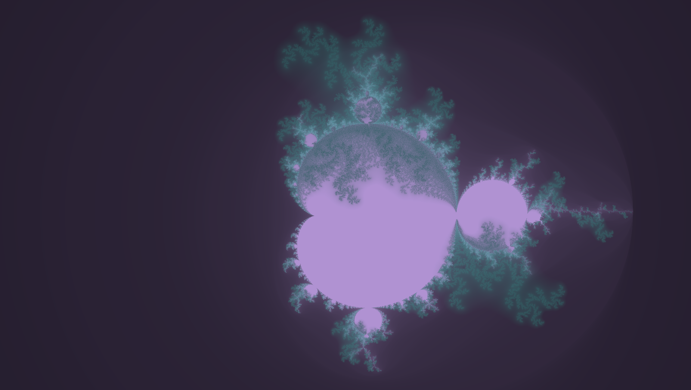

# A ShaderToy like program

Can be used to play with a fragment shaders over a surface

Shortcut | Action
--- | --- 
R | Reload shader
W | move the camera UP
A | move the camera LEFT
S | move the camera DOWN
D | move the camera RIGHT
